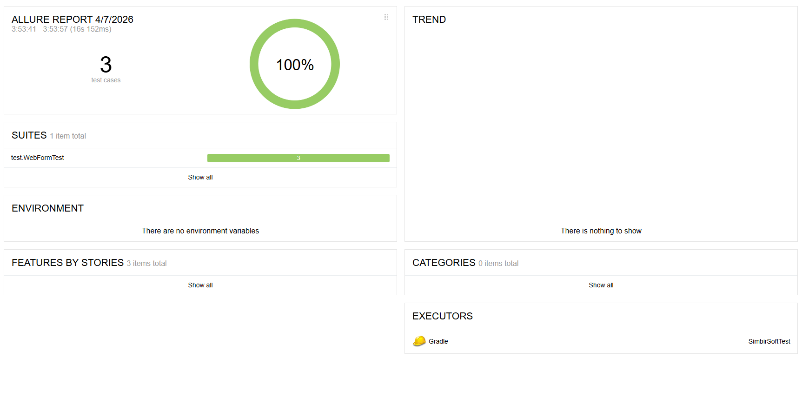
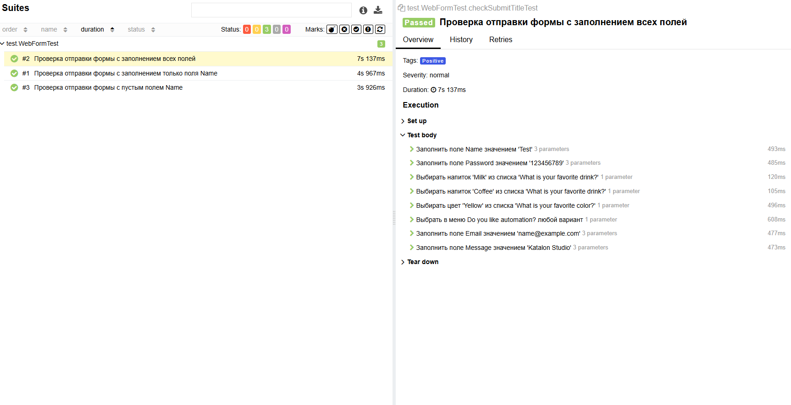
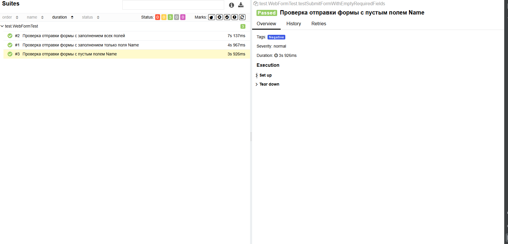

# Тестовое задание Люст Анастасии

## Описание
Проект UI-автотестов для SimbirSoft для формы на сайте https://practice-automation.com/form-fields/

## Технологии
- Java 25
- Gradle
- Selenium WebDriver
- JUnit 5
- Allure Report

## Тест-кейсы

### TC - 1:  Проверка отправки формы с заполнением всех полей
#### Тег: Позитивный тест-кейс
| Field                    | Value                                                                                                                                                                                                                                                                                                                                                                                                                                                                                                                                     |
|--------------------------|-------------------------------------------------------------------------------------------------------------------------------------------------------------------------------------------------------------------------------------------------------------------------------------------------------------------------------------------------------------------------------------------------------------------------------------------------------------------------------------------------------------------------------------------|
| **Тест-кейс ID**         | TC - 1                                                                                                                                                                                                                                                                                                                                                                                                                                                                                                                                    |
| **Предусловие:**         | 1. Открыть браузер   2. Перейти по ссылке https://practice-automation.com/form-fields/                                                                                                                                                                                                                                                                                                                                                                                                                                                 |
| **Шаги**                 | 1. Заполнить поле Name  2. Заполнить поле Password  3. Из списка What is your favorite drink? выбрать Milk и Coffee  4. Из списка What is your favorite color? выбрать Yellow  5. В поле Do you like automation? выбрать любой вариант  6. Поле Email заполнить строкой формата name@example.com  7. В поле Message написать количество инструментов, описанных в пункте Automation tools, и написать инструмент из списка Automation tools, содержащий наибольшее количество символов   8.  Нажать на кнопку Submit |
| **Ожидаемый результат:** | Появился алерт с текстом Message received!                                                                                                                                                                                                                                                                                                                                                                                                                                                                                                |

### TC - 2:  Проверка отправки формы с заполнением только поля Name
#### Тег: Позитивный тест-кейс
| Field                    | Value                                                                                     |
|--------------------------|-------------------------------------------------------------------------------------------|
| **Тест-кейс ID**         | TC - 2                                                                                    |
| **Предусловие:**         | 1. Открыть браузер   2. Перейти по ссылке https://practice-automation.com/form-fields/ |
| **Шаги**                 | 1. Заполнить поле Name  2. Нажать на кнопку Submit                                     |
| **Ожидаемый результат:** | Появился алерт с текстом Message received!                                                

### TC - 3:  Проверка отправки формы с пустым полем Name
#### Тег: Негативный тест-кейс
| Field                    | Value                                                                                     |
|--------------------------|-------------------------------------------------------------------------------------------|
| **Тест-кейс ID**         | TC - 3                                                                                    |
| **Предусловие:**         | 1. Открыть браузер   2. Перейти по ссылке https://practice-automation.com/form-fields/ |
| **Шаги**                 | 1. Нажать на кнопку Submit                                                                |
| **Ожидаемый результат:** | Появился алерт с текстом Message received!                                                

##  Allure отчет

 Общий Allure отчет

 ТС-1: Проверка отправки формы с заполнением всех полей

 ТС-2: Проверка отправки формы с заполнением только поля Name

 ТС-3:Проверка отправки формы с пустым полем Name

